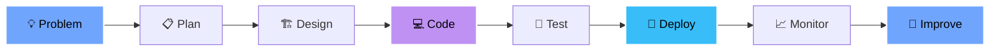

<div align="center">

# Hi, I'm Amit Kumar 👋

### Full-Stack Developer | AI Integration Specialist | Building Production Systems


[](https://www.linkedin.com/in/amitkumar0027/)
[](mailto:amitkumar91344@gmail.com)
[](https://github.com/amitakr0027)

</div>

---

## 👨‍💻 About Me


```typescript
const amitKumar = {
    location: "India 🇮🇳",
    education: "Computer Science Engineering",
    role: "Full-Stack Developer",
    
    focus: [
        "Production-Ready Applications",
        "AI/ML Integration",
        "System Architecture",
        "Performance Optimization"
    ],
    
    approach: "Clean code, scalable systems, user-first design",
    
    currentlyBuilding: "AI-powered web applications",
    learningNext: "Advanced system design patterns",
    openTo: "Full-time roles & collaborations"
};
```

I specialize in building **production-grade applications** with modern technologies. My focus is on creating systems that are not just functional, but **performant, secure, and maintainable** at scale.

---

## 🛠️ Technology Stack

<div align="center">

### Frontend


### Backend & Database


### AI & Cloud


### Tools & Workflow


</div>

---

## 🌟 Featured Project: FoodSnap

<div align="center">

### 🍎 AI-Powered Food Analysis Platform

**Scan Smart, Eat Healthy — Your AI Food Intelligence System**

[](https://foodsnap-plum.vercel.app)
[](https://github.com/amitakr0027/FOODSNAP)


</div>

<br/>

<table>
<tr>
<td width="50%">

### ✨ Core Features

**Smart Scanning**
- Real-time barcode recognition
- Camera integration with instant detection
- Product database integration

**AI Analysis**
- Powered by Google Gemini 3 Flash
- Comprehensive nutrition breakdown
- Health scoring algorithm
- Ingredient analysis

**Personalization**
- Custom allergen detection
- User health profile tracking
- Dietary preference alerts
- Scan history & favorites

**Security & Performance**
- Server-side API architecture
- No exposed credentials
- Optimized rendering
- 95+ Lighthouse score

</td>
<td width="50%">

### 🏗️ Technical Architecture

**Frontend Excellence**
```javascript
// Next.js 14 App Router
- TypeScript strict mode
- Server/Client components
- Optimized image loading
- Virtual list rendering
- Debounced search
```

**Backend Design**
```javascript
// Secure & Scalable
- Node.js runtime (Vercel)
- RESTful API design
- Input validation
- Firebase Authentication
- Firestore database
```

**AI Integration**
```javascript
// Intelligent Processing
- Google Gemini 3 Flash
- Server-only inference
- Prompt engineering
- Response parsing
```

</td>
</tr>
</table>

<div align="center">

### 🎯 Why This Project Matters

| **Production-Ready** | **User-Centric** | **Scalable Architecture** |
|:---:|:---:|:---:|
| Built for real users | Intuitive UI/UX | Clean code patterns |
| Deployed on Vercel | Loading & error states | Modular design |
| Monitored performance | Mobile responsive | Type-safe codebase |

**This isn't a demo — it's a live application serving real users with production-grade infrastructure.**

[🚀 Try Live Demo](https://foodsnap-plum.vercel.app) • [📖 Read Documentation](https://github.com/amitakr0027/FOODSNAP#readme)

</div>

---

## 📊 GitHub Statistics

<div align="center">


</div>

---

## 💡 Development Philosophy

<div align="center">



</div>

### Core Principles

<table>
<tr>
<td align="center" width="25%">
<br/>
<b>Clean Code</b><br/>
<sub>Readable, maintainable,<br/>self-documenting</sub>
</td>
<td align="center" width="25%">
<br/>
<b>Performance</b><br/>
<sub>Optimized from<br/>the ground up</sub>
</td>
<td align="center" width="25%">
<br/>
<b>Security</b><br/>
<sub>Authentication,<br/>validation, best practices</sub>
</td>
<td align="center" width="25%">
<br/>
<b>Scalability</b><br/>
<sub>Built for growth<br/>and real-world use</sub>
</td>
</tr>
</table>

---

## 🎯 What I Bring

<table>
<tr>
<td width="50%">

### 💼 Technical Skills

- ✅ Production-grade application development
- ✅ Modern web technologies (Next.js, React, TypeScript)
- ✅ AI/ML integration (Google Gemini, OpenAI)
- ✅ Full-stack architecture design
- ✅ RESTful API development
- ✅ Database design and optimization
- ✅ Cloud deployment (Vercel, Firebase, GCP)
- ✅ Performance optimization techniques
- ✅ Security best practices

</td>
<td width="50%">

### 🚀 Professional Approach

- ✅ Self-driven and proactive
- ✅ Quick learner with strong fundamentals
- ✅ Clear technical communication
- ✅ Collaborative team player
- ✅ Detail-oriented problem solver
- ✅ Deadline-focused execution
- ✅ Open to feedback and mentorship
- ✅ Continuous learning mindset
- ✅ Documentation and code quality focus

</td>
</tr>
</table>

---

## 🏆 GitHub Achievements

<div align="center">

[](https://github.com/ryo-ma/github-profile-trophy)

</div>

---

## 🔭 Current Focus

<div align="center">

| 💼 Working On | 🌱 Learning | 👯 Open To | 💡 Exploring |
|:---:|:---:|:---:|:---:|
| Scaling AI Applications | Advanced System Design | Full-Time Roles | Cloud Architecture |
| Performance Optimization | Microservices Patterns | Freelance Projects | DevOps Practices |
| Open Source Contributions | Next.js 15 Features | Technical Collaborations | Web3 Technologies |

</div>

---

## 📫 Let's Connect

<div align="center">


### I'm always open to discussing:

💼 **Full-Time Opportunities** • 🚀 **Freelance Projects** • 🤝 **Collaborations** • 💡 **Tech Discussions**

<br/>

[](https://www.linkedin.com/in/amitkumar0027/)
[](mailto:amitkumar91344@gmail.com)
[](https://github.com/amitakr0027)

<br/>

### 📱 Check Out My Work

[](https://foodsnap-plum.vercel.app)
[](https://github.com/amitakr0027?tab=repositories)

---


### ⚡ *Building production-ready systems, one commit at a time*

**💼 Open to Full-Time Software Engineering Roles | Remote | Hybrid | On-site**

<sub>Crafted with 💙 by Amit Kumar • Last Updated: February 2026</sub>

</div>

---

<div align="center">

**💭 "Code is like humor. When you have to explain it, it's bad." — Cory House**

⭐ **Star my repositories if you find them useful!**

</div>
